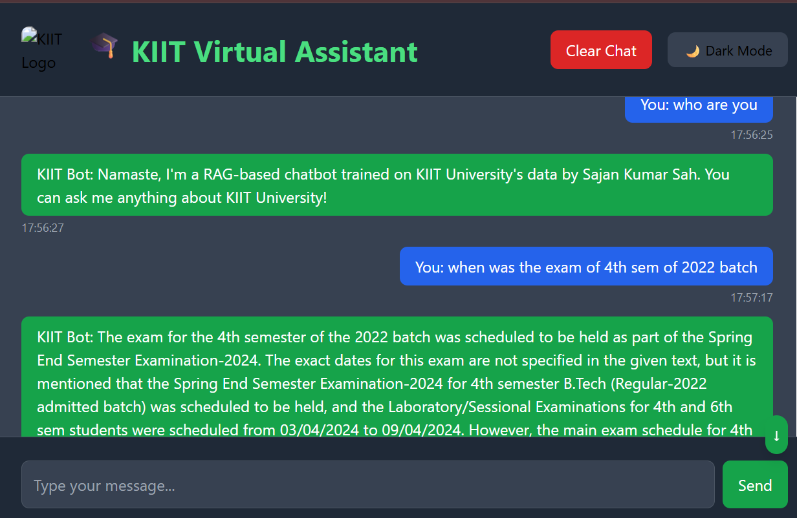

# 🎓 KIIT Virtual Assistant – RAG-Based Chatbot (v1.0)

> A private, AI-powered chatbot for **KIIT University students**, built using **RAG (Retrieval-Augmented Generation)**. This assistant understands your college emails, circulars, and notices, and answers queries with context-aware responses — all with a sleek, dark-mode UI and blazing-fast response time.

 <!-- Add a real screenshot -->

---

## 🚀 Features

- 🔍 **Semantic Search with FAISS** for ultra-fast document retrieval
- 🤖 **LLM-Powered Responses** using RAG (Retriever + Generator)
- 🧠 **Custom-trained embeddings** on your personal KIIT email data
- 🛡️ **Private & Offline** — No data leaves your machine
- 🌙 **Dark/Light Mode UI** with animated feedback and typing effects
- 💬 Real-time chat with timestamped messages and scroll-to-bottom support
- 🔄 Chat history persistence using `localStorage`

---

## 🛠️ Tech Stack

| Component        | Tech Used                                 |
|------------------|-------------------------------------------|
| 🧠 LLM Generator  | OpenAI / HuggingFace LLM (plug & play)    |
| 📚 Vector Store   | FAISS with HNSW index                     |
| 🧾 Embedding Model| `all-MiniLM-L6-v2` via `sentence-transformers` |
| 📡 Backend        | FastAPI / Flask (in `inference.py`)       |
| 💻 Frontend UI    | HTML + Tailwind CSS + Animate.css         |
| 🔌 RAG Engine     | Custom Python pipeline                    |

---

 How It Works (RAG Pipeline)
mermaid
Copy
Edit
graph TD;
    A[User Query] --> B[Embed Query];
    B --> C[Search FAISS];
    C --> D[Top Relevant Chunks];
    D --> E[Pass to LLM];
    E --> F[Final Response]

📍 Use Cases
📧 Ask about exam dates, circulars, placement info from your inbox

📁 Query large private documents stored locally

📚 Build future academic bots using this framework

📌 Deployment
Deploy backend with Render

Serve frontend via GitHub Pages

👨‍💻 Author
Mr. Sajan Sah

